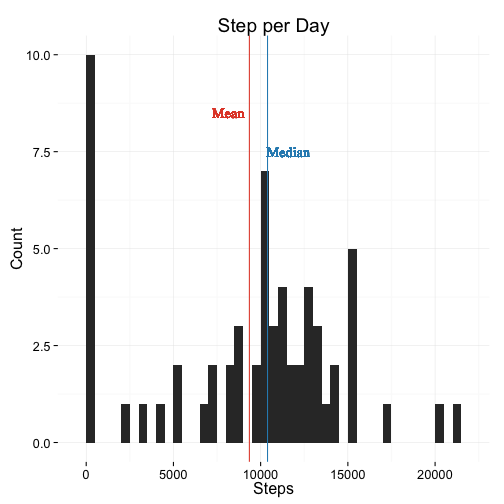
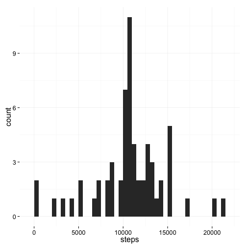
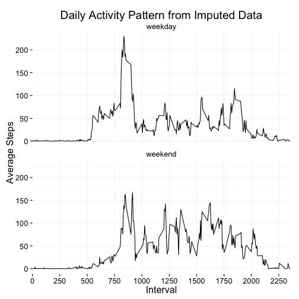

Peer Assessment 1 - Activity Monitoring Data
========================================================

## Loading and Preprocessing the Data

```r

# Read in the data

temp <- tempfile()
download.file("https://d396qusza40orc.cloudfront.net/repdata%2Fdata%2Factivity.zip", 
    temp, method = "curl")
file <- unz(temp, "activity.csv")
data <- read.csv(file)
unlink(temp)

# Format the date
suppressMessages(require(lubridate))
data$date <- ymd(data$date)
```


## What is mean total number of steps taken per day?

```r
suppressMessages(require(dplyr))
suppressMessages(require(ggplot2))
theme_set(theme_minimal(16))

stepsPerDay <- data %.% group_by(date) %.% summarize(steps = sum(steps, na.rm = T))

meanSteps <- round(mean(stepsPerDay$step, na.rm = T), 2)
medianSteps <- median(stepsPerDay$step, na.rm = T)
```


```r
ggplot(aes(steps), data = stepsPerDay) + geom_histogram(bin = 500) + geom_vline(xint = meanSteps, 
    color = "#e34a33") + geom_text(label = "Mean", x = meanSteps - 1200, y = 8.5, 
    col = "#e34a33", family = "Times", fontface = "plain") + geom_vline(xint = medianSteps, 
    color = "#2b8cbe") + geom_text(label = "Median", x = medianSteps + 1200, 
    y = 7.5, col = "#2b8cbe", family = "Times", fontface = "plain") + labs(title = "Step per Day", 
    x = "Steps", y = "Count")
```

 


The mean number of steps per day is 9354.23.  
The median number of steps per day is 10395.  

## What is the average daily activity pattern?

```r
avgAct <- data %.% group_by(interval) %.% summarize(meanSteps = mean(steps, 
    na.rm = T))
```


```r
ggplot(aes(x = interval, y = meanSteps), data = avgAct) + geom_line() + scale_x_discrete(breaks = seq(0, 
    max(data$interval), 250)) + labs(title = "Daily Activity Pattern", x = "Interval", 
    y = "Average Steps")
```

 

```r

maxMeanSteps <- max(avgAct$meanSteps)
max <- avgAct[avgAct$meanSteps == maxMeanSteps, ]
maxInterval <- max$interval
```


Which 5-minute interval, on average across all the days in the dataset, contains the maximum number of steps?  

The interval is 835.  

## Imputing missing values

```r
naValues <- sum(is.na(data$steps))
```


There are 2304 missing values in the data set.  

Strategy for imputing values: Replace NA values with mean number of steps for given interval.  


```r
impute <- function(df) {
    
    newData <- df
    
    for (i in 1:dim(df)[1]) {
        
        if (is.na(df[i, "steps"])) {
            step <- df[i, "interval"]
            value <- avgAct[avgAct$interval == step, ]$meanSteps
            newData[i, "steps"] <- value
        }
    }
    return(newData)
}

imputedData <- impute(data)
```


Make a histogram of the total number of steps taken each day and Calculate and report the mean and median total number of steps taken per day. Do these values differ from the estimates from the first part of the assignment? What is the impact of imputing missing data on the estimates of the total daily number of steps?  


```r
imputedStepsPerDay <- imputedData %.% group_by(date) %.% summarize(steps = sum(steps))
```


```r
ggplot(aes(steps), data = imputedStepsPerDay) + geom_histogram(bin = 500)
```

 


```r
meanImputedSteps <- mean(imputedStepsPerDay$steps)
medianImputedSteps <- median(imputedStepsPerDay$steps)
```


The mean total number of steps per day for the imputed data is 1.0766 &times; 10<sup>4</sup>.  

The median total number of steps per day for the imputed data is 1.0766 &times; 10<sup>4</sup>.  

## Are there differences in activity patterns between weekdays and weekends?


```r
weekendDays <- c("Saturday", "Sunday")
imputedData$day <- weekdays(imputedData$date)
imputedData$dayType <- ifelse(imputedData$day %in% weekendDays, "weekend", "weekday")
imputedData$dayType <- factor(imputedData$dayType)

avgImputedAct <- imputedData %.% group_by(interval, dayType) %.% summarize(meanSteps = mean(steps))
```


```r
ggplot(aes(x = interval, y = meanSteps), data = avgImputedAct) + facet_wrap(~dayType, 
    nrow = 2) + geom_line() + scale_x_discrete(breaks = seq(0, max(data$interval), 
    250)) + labs(title = "Daily Activity Pattern from Imputed Data", x = "Interval", 
    y = "Average Steps")
```

 

